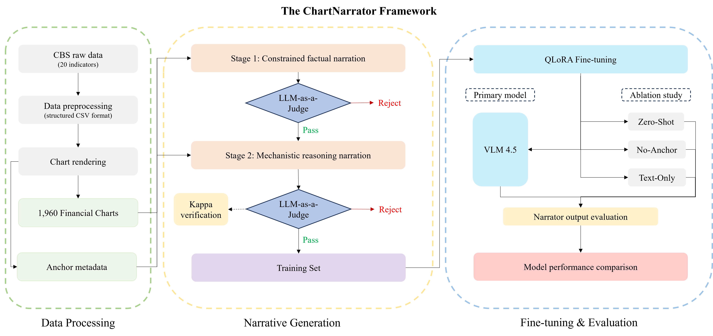
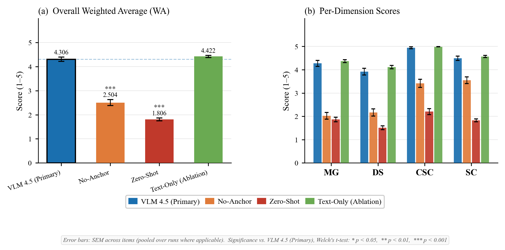

# ChartNarrator

> Towards faithful chart-to-text generation for financial time series.

ChartNarrator is a research pipeline for generating faithful natural-language narratives from financial time-series charts. It combines structured anchor metadata, a two-stage generation pipeline, LLM-as-a-Judge filtering, human agreement validation, and QLoRA fine-tuning to study how chart-visible numerical evidence can be translated into source-bounded explanatory text.

<p align="center">
  
</p>

<p align="center">
  <em>Figure 1: Overview of the ChartNarrator pipeline.</em>
</p>

## Overview

Faithful chart narration is treated here as an explainability problem: every factual or interpretive claim in a generated narrative should be traceable to a visible chart property or to an explicit source constraint.

The project focuses on financial and macroeconomic time series from CBS Open Data. It studies four recurring faithfulness failures in multimodal chart narration:

- **Trend Direction Error**
- **Numerical Faithfulness Violation**
- **External Causal Hallucination**
- **Latent-state Mechanism Wording**

ChartNarrator addresses these failures with three design components:

1. **Anchor metadata injection**: structured numerical, temporal, semantic, and morphology signals are extracted from each chart and passed to the generator.
2. **Two-stage generation**: Stage 1 produces constrained factual narration; Stage 2 produces source-bounded mechanistic reasoning.
3. **Verified evaluation**: LLM-as-a-Judge scores are checked against human ratings using linear-weighted Cohen's Kappa.

## Main results

The final evaluation compares four conditions on the same held-out Stage 2 test set (`n = 124`). Text-Only scores are averaged over three repeated Judge runs.

| Condition | Input | MG | DS | CSC | SC | WA | FC (%) |
| --- | --- | ---: | ---: | ---: | ---: | ---: | ---: |
| VLM 4.5 | Image + anchor | 4.274 | 3.919 | 4.944 | 4.492 | 4.306 | 100.0 |
| No-Anchor | Image only | 2.024 | 2.161 | 3.419 | 3.548 | 2.504 | 81.5 |
| Zero-Shot | Image + anchor, no fine-tuning | 1.863 | 1.508 | 2.202 | 1.829 | 1.806 | 0.0 |
| Text-Only | Serialized time series + anchor | 4.368 | 4.113 | 4.987 | 4.567 | 4.422 | 100.0 |

`MG`, `DS`, `CSC`, and `SC` denote Mechanistic Grounding, Dependency Strength, Closed-System Compliance, and Structural Coherence. `WA` is the weighted average score:

```text
WA = 0.35 * MG + 0.35 * DS + 0.20 * CSC + 0.10 * SC
```

`FC(Format Compliance) (%)` is three-paragraph format compliance.

<p align="center">
  
</p>

<p align="center">
  <em>Figure 2: Evaluation results across the four experimental conditions.</em>
</p>

## Repository structure

```text
ChartNarrator_public/
├── configs/                      # Optional training configuration snapshots
├── docs/                         # Pipeline and data schema documentation
├── examples/                     # Small JSON examples for public inspection
├── experiments/
│   └── stage1_control/           # Stage 1 external-context control experiment
├── notebooks/
│   ├── finetuning/               # QLoRA fine-tuning notebooks
│   └── inference/                # Zero-shot inference notebook
├── scripts/
│   ├── data/                     # CBS download, cleaning, and chart rendering
│   ├── stage1/                   # Stage 1 anchor extraction, generation, judging, analysis
│   ├── stage2/                   # Stage 2 candidate selection, anchors, generation, judging, analysis
│   ├── finetuning/               # Dataset preparation scripts
│   ├── evaluation/               # Prediction judging scripts
│   └── validation/               # Human-review sampling and Kappa computation
├── requirements.txt              # Lightweight pipeline dependencies
├── requirements-train.txt        # Optional GPU fine-tuning dependencies
└── README.md
```

Large generated data, chart images, model checkpoints, and private API credentials are intentionally excluded from version control.

## Installation

Create a Python environment from the repository root:

```bash
python -m venv .venv
source .venv/bin/activate      # macOS/Linux
# .venv\Scripts\activate       # Windows PowerShell

pip install -r requirements.txt
```

For GPU fine-tuning or VLM inference notebooks, install the optional training dependencies in a CUDA-enabled environment:

```bash
pip install -r requirements-train.txt
```

The fine-tuning notebooks include Colab-oriented installation cells. PyTorch wheels may need to be adapted to the target CUDA runtime.

## API keys

Generation and LLM-as-a-Judge scripts require access to Gemini through the `google-generativeai` package. Set the key through an environment variable before running generation or judging steps:

```bash
export GOOGLE_API_KEY="your_api_key_here"
```

Do not hard-code API keys in scripts or notebooks. If a private key was ever committed to Git history, rotate the key and remove it from history before publishing the repository.

## Pipeline

The full pipeline is organized as follows.

### 1. Data preparation

```bash
python scripts/data/fetch_cbs_data.py
python scripts/data/clean_cbs_data.py
python scripts/data/generate_charts.py --seed 42
```

This stage downloads selected CBS Open Data series, normalizes them into cleaned monthly time-series CSV files, and renders random-window chart images.

The chart renderer preserves the original experimental design:

- seven configured flow series use a 12-month rolling sum;
- all other series use a 12-month moving average;
- windows shorter than 24 observations use raw values;
- random windows follow a 20/60/20 short-, medium-, and long-window sampling ratio.

### 2. Stage 1: constrained factual narration

```bash
python scripts/stage1/extract_anchors.py
python scripts/stage1/generate_narratives.py
python scripts/stage1/judge_narratives.py
python scripts/stage1/analyze_quality.py
```

Stage 1 extracts low-ambiguity numerical and temporal anchors, generates factual chart descriptions, and filters outputs using an LLM-as-a-Judge protocol over syntactic, semantic, and pragmatic dimensions. Semantic correctness is used as the hard filtering signal.

### 3. Stage 2: source-bounded mechanistic reasoning

```bash
python scripts/stage2/extract_candidate_pool.py
python scripts/stage2/extract_anchors.py
python scripts/stage2/filter_candidate_pool.py
python scripts/stage2/generate_narratives.py
python scripts/stage2/judge_narratives.py
python scripts/stage2/analyze_quality.py
```

Stage 2 extends the Stage 1 anchor layer with variable semantics, trend structure, morphology signals, and complexity routing. Complex-route outputs follow a three-paragraph format:

```text
Paragraph 1: Observed Structure
Paragraph 2: Mechanistic Interpretation
Paragraph 3: Dependency Resolution
```

Simple-route outputs use a compressed two-paragraph format.

Stage 2 outputs are evaluated on four dimensions:

| Dimension | Weight | Description |
| --- | ---: | --- |
| Mechanistic Grounding (MG) | 0.35 | Whether mechanisms are grounded in chart-visible structure. |
| Dependency Strength (DS) | 0.35 | Whether dependency resolution captures a meaningful cross-stage relation. |
| Closed-System Compliance (CSC) | 0.20 | Whether the narrative avoids external events, agents, or unsupported causes. |
| Structural Coherence (SC) | 0.10 | Whether paragraphs perform their intended structural roles. |

### 4. Fine-tuning dataset construction

```bash
python scripts/finetuning/prepare_vlm_dataset.py
python scripts/finetuning/prepare_noanchor_dataset.py
python scripts/finetuning/prepare_matched_vlm_dataset.py
python scripts/finetuning/build_text_representations.py
python scripts/finetuning/prepare_textonly_dataset.py
```

These scripts construct the public fine-tuning and ablation datasets from Judge-filtered Stage 2 outputs.

The primary VLM 4.5 condition uses samples satisfying:

```text
WA >= 4.5 and all individual Stage 2 dimension scores > 2
```

The final VLM 4.5 dataset contains 1,234 examples and is split into:

```text
train = 986
validation = 124
test = 124
```

### 5. Fine-tuning and inference notebooks

The fine-tuning and inference notebooks are provided under `notebooks/`.

| Notebook | Purpose |
| --- | --- |
| `notebooks/finetuning/vlm_4_5.ipynb` | Main VLM fine-tuning condition using image + anchor input. |
| `notebooks/finetuning/vlm_5_0.ipynb` | High-threshold VLM condition using all-5 examples. |
| `notebooks/finetuning/vlm_4_5_matched.ipynb` | VLM 4.5 condition matched to the VLM 5.0 split. |
| `notebooks/finetuning/vlm_noanchor_4_5.ipynb` | No-Anchor ablation with chart image but without anchor metadata. |
| `notebooks/finetuning/textonly_4_5.ipynb` | Text-Only ablation using serialized time-series data and anchor metadata. |
| `notebooks/inference/zeroshot_inference.ipynb` | Zero-shot Qwen2-VL inference without LoRA fine-tuning. |

The main fine-tuning setup uses QLoRA with 4-bit quantization and LoRA rank 64. The VLM conditions use `Qwen/Qwen2-VL-7B-Instruct`; the Text-Only condition uses `Qwen/Qwen2.5-7B-Instruct`.

### 6. Prediction evaluation

```bash
python scripts/evaluation/judge_vlm_predictions.py
python scripts/evaluation/judge_textonly_predictions.py
```

These scripts apply the same Stage 2 Judge protocol to model predictions from the fine-tuned and baseline conditions.

### 7. Human validation and Kappa analysis

```bash
python scripts/validation/prepare_kappa_review.py
python scripts/validation/compute_kappa.py
```

The human-validation subset contains 80 complex-route Stage 2 narratives. Agreement between the LLM Judge and the human annotator is measured with linear-weighted Cohen's Kappa.

| Dimension | Kappa | Interpretation |
| --- | ---: | --- |
| MG | 0.306 | Fair |
| DS | 0.659 | Substantial |
| CSC | N/A | Degenerate; both raters assigned 5 to all entries |
| SC | 0.323 | Fair |
| Weighted summary | 0.463 | Moderate |

## Data and reproducibility notes

This repository contains the code required to reproduce the ChartNarrator pipeline, but does not include large generated datasets, chart images, model checkpoints, or API credentials.

Expected generated data locations include:

```text
data/raw_cbs_data/
data/cleaned_csv_data/
data/images/
data/stage1/
data/stage2/
data/finetune_dataset_4_5/
data/finetune_dataset_5_0/
data/finetune_dataset_4_5_matched/
data/finetune_noanchor_4_5/
data/finetune_textonly_4_5/
data/evaluation/
data/validation/
```

These directories are ignored by `.gitignore` by default. To make the repository easier to inspect without full reproduction, add small schema examples under `examples/`.


## Citation

If you use this repository or build on ChartNarrator, please cite the forthcoming paper:

```bibtex
@inproceedings{liu2026chartnarrator,
  title     = {ChartNarrator: Towards Faithful Chart-to-Text Generation for Financial Time Series},
  author    = {Liu, Yutao and van Stein, Niki and Visser, Joost},
  booktitle = {Proceedings of the International Conference on Explainable AI for Neural and Symbolic Methods},
  year      = {2026},
  note      = {To appear}
}
```

## License

This repository is released under the MIT License. See `LICENSE` for details.

This license applies to the code in this repository. Third-party models, datasets, APIs, and libraries remain subject to their own licenses and terms of use. This repository does not redistribute model weights or API credentials.

## Acknowledgements

This project was developed as part of the MSc Computer Science program at Leiden University, Leiden Institute of Advanced Computer Science (LIACS).
